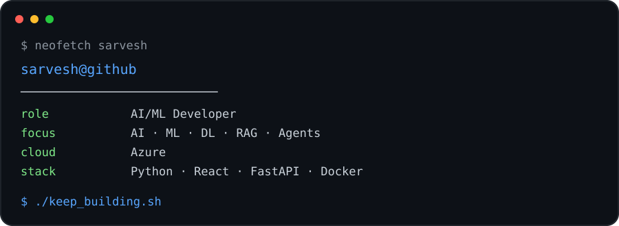

<div align="center">

# `sarveshraghavan`

### AI / ML Developer · CSE Student · Builder

**Building AI systems that actually work.**

[](https://github.com/sarveshraghavan)
[](https://www.python.org/)
[](https://azure.microsoft.com/)

</div>

---


## `$ neofetch sarvesh`

<div align="center">



</div>

## 🧑‍💻 About Me

I'm a Computer Science Engineering student focused on building practical AI systems across **Artificial Intelligence, Machine Learning, Deep Learning, Computer Vision, NLP, and Cloud**.

I like taking ideas from **model → backend → deployment → production**.

```text
AI → Retrieval → Agents → APIs → Cloud → Monitoring
```

---

## 💼 Current Work

### AI/ML Intern · Prosapient AI

Working on enterprise knowledge and retrieval systems.

- 🔎 Building **RAG pipelines** from document ingestion to response generation
- 🧩 Designing **hybrid retrieval** with structured OKF lookups, vector search, and Gemini re-ranking
- 🤖 Working with **Ingestor, Structurer, Linker, and Chat agents**
- 🧪 Improving reliability through **LLM evaluation and prompt engineering**
- 🗄️ Evaluating **ChromaDB** and **Vertex AI Vector Search**
- ☁️ Working with **Docker, Terraform, GitHub Actions, Azure, and Grafana**

---

# 🚀 Featured Projects

## 🎓 VidLearn AI

**Turn videos into structured learning material.**

AI-powered learning platform that converts YouTube URLs and uploaded videos into:

`Notes` · `Summaries` · `Flashcards` · `Quizzes` · `Key Concepts` · `Mind Maps`

**Stack:** `React` `FastAPI` `Python` `Gemini 2.5 Flash-Lite` `Whisper` `SQLite` `Docker` `Terraform` `Azure`

**Highlights**
- 🎥 Gemini-based YouTube video processing
- 🎙️ Local Whisper speech-to-text for uploaded videos
- 🧠 AI-generated study material
- 🔐 JWT authentication
- ⚡ SHA-256 smart caching to avoid repeated AI generation
- ☁️ Azure Container Apps + Static Web Apps
- 🔄 GitHub Actions CI/CD
- 🏗️ Terraform infrastructure

---

## 🔎 RAG-Based Chatbot

**Grounding LLM responses in external documents.**

```text
Documents
   ↓
Ingestion → Chunking → Embeddings → Vector Index
   ↓
Similarity Retrieval
   ↓
Context + Prompt
   ↓
TinyLlama-1.1B-Chat
   ↓
Grounded Response
```

**Stack:** `Python` `TinyLlama-1.1B-Chat` `E5-Small-v2` `Vector Search`

---

## 🛡️ PhishGuard AI

**AI-powered phishing and social-engineering detection.**

Full-stack cybersecurity application combining a Chrome extension with an AI backend.

**Stack:** `JavaScript` `Chrome Extension` `Flask` `REST API` `Gemini`

- 📧 Gmail phishing analysis
- 🧠 Semantic social-engineering analysis
- 🚨 Intent classification
- 📊 Structured risk reports
- ⚡ Real-time detection

---

## 👁️ AI Classroom Monitoring System

**Real-time classroom analytics using computer vision.**

**Stack:** `YOLO` `MediaPipe` `DeepFace` `OpenCV` `MongoDB` `Python`

- 👤 Student identification
- 👀 Face and eye tracking
- 📱 Phone/distraction detection
- 📈 Session-level metrics
- 🔔 Automated alerts
- 🎯 Temporal smoothing for fewer false positives

---

## 🧾 Multimodal Claim Investigator

**AI-assisted insurance claim investigation across multiple modalities.**

```text
Images ──┐
Videos ──┤
Audio  ──┼──→ Multimodal Retrieval → Investigation Report
Docs   ──┘
```

**Stack:** `Gemini` `ChromaDB` `Multimodal Embeddings` `FastAPI` `Python`

- 🖼️ Image analysis
- 🎥 Video analysis
- 🎙️ Audio processing
- 📄 Document analysis
- 🔎 Cross-modal retrieval
- 📝 AI-generated investigation reports
- 🔗 Source citations

---

## 🏥 Patient-First Health Advocate Agent

**Privacy-focused AI agent for health-monitoring workflows.**

**Stack:** `Gemini` `Auth0` `Google Fit` `OAuth` `Agentic AI` `SMS`

- 🔐 Secure OAuth token management
- ❤️ Heart-rate monitoring
- 🚨 Threshold-based alerts
- 🧠 AI-generated trend summaries
- 🔒 Zero-trust sensitive workflows
- 👆 Biometric step-up authentication

---

# 🧠 Artificial Intelligence

`Generative AI` `LLMs` `RAG` `Agentic AI` `Prompt Engineering`
`LLM Evaluation` `Multimodal AI` `Gemini` `Hugging Face`

# 📊 Machine Learning

`Scikit-learn` `Classification` `Regression` `Feature Engineering`
`Model Evaluation` `Model Optimization` `ML Pipelines`

# 🧠 Deep Learning

`PyTorch` `TensorFlow` `CNN` `RNN` `LSTM` `Transformers`

# 👁️ Computer Vision

`OpenCV` `YOLO` `MediaPipe` `DeepFace`

`Object Detection` · `Image Segmentation` · `Facial Recognition` · `Real-Time Vision`

# 📝 NLP

`Whisper` `Hugging Face` `Transformers` `Embeddings`
`Semantic Search` `Text Classification` `Sentiment Analysis`

# 💻 Software Development

**Languages:** `Python` `Java` `C` `SQL` `JavaScript`

**Backend:** `FastAPI` `Flask` `REST APIs`

**Frontend:** `React` `Vite` `HTML` `CSS` `JavaScript`

# ☁️ Cloud & DevOps

`Azure` `Docker` `Terraform` `GitHub Actions` `Grafana`

- Azure Container Apps
- Azure Static Web Apps
- Azure Container Registry
- Infrastructure as Code
- CI/CD
- Monitoring & observability

# 🔐 Cybersecurity

`Phishing Detection` `Social Engineering Detection`
`Vulnerability Analysis` `Risk Management` `Compliance`
`Security AI`

---

# 🧩 Problem Solving

Sharpening algorithmic thinking through DSA and competitive-programming style problems.

`Arrays` `Strings` `Hashing` `Sorting` `Binary Search`
`Greedy` `Dynamic Programming` `Graphs` `Subsequences`
`GCD` `Number Theory` `Grid Traversal`

---

# 📈 GitHub

<div align="center">


</div>

### 🐍 Contribution Graph

<div align="center">


</div>

---

<div align="center">

### `Build → Break → Learn → Build Again.`

⭐ Explore the repositories. Build something interesting.

</div>

