<div align="center">

# 👋 Hi, I'm Sarvesh Raghavan

### AI/ML Developer · Computer Science Engineering Student

**Building intelligent systems from models to production.**

`Artificial Intelligence · Machine Learning · Deep Learning · RAG · Agentic AI`

<br/>

[](https://github.com/sarveshraghavan)
[](https://www.python.org/)
[](https://azure.microsoft.com/)
<!-- LinkedIn omitted — no verified URL found in repository; add badge here when available -->

</div>

---

<div align="center">

</div>

---

## ⚡ Currently Building

<pre>
$ role
AI/ML Intern @ Prosapient AI

$ currently_building
Enterprise RAG + Agentic AI

$ interests
AI · ML · Deep Learning · Computer Vision · NLP

$ philosophy
Build → Break → Learn → Build Again
</pre>

---

## 🧑‍💻 About Me

I'm a Computer Science Engineering student focused on building practical AI systems and turning ideas into working applications.

My interests span Artificial Intelligence, Machine Learning, Deep Learning, Computer Vision, NLP, RAG, and Agentic AI.

I enjoy working across the full development cycle:

```
Problem
  ↓
Model / AI System
  ↓
Backend & APIs
  ↓
Cloud Deployment
  ↓
Monitoring
```

Currently exploring how LLMs, retrieval systems, and AI agents can be combined to build reliable real-world applications.

---

## 💼 Current Work

### AI/ML Intern · Prosapient AI

- Building RAG pipelines from document ingestion to response generation
- Designing hybrid retrieval combining structured OKF lookups, vector search, and Gemini re-ranking
- Working with Ingestor, Structurer, Linker, and Chat agents
- Performing LLM evaluation and prompt engineering to improve reliability
- Evaluating ChromaDB and Vertex AI Vector Search
- Working with Docker, Terraform, GitHub Actions, Azure, and Grafana

---

## 🚀 Featured Projects

<table>
<tr>
<td width="50%" valign="top">

### 🎓 VidLearn AI

**AI-powered learning platform converting YouTube URLs and uploaded videos into:**

`Notes` · `Summaries` · `Flashcards` · `Quizzes` · `Key Concepts` · `Mind Maps`

**Tech:** `React` `FastAPI` `Python` `Gemini 2.5 Flash-Lite` `Whisper` `SQLite` `SQLAlchemy` `Docker` `Terraform` `Azure` `GitHub Actions`

- YouTube processing with Gemini 2.5 Flash-Lite
- Whisper speech-to-text for uploaded videos
- AI-generated study material
- JWT authentication
- SHA-256 smart caching
- Azure deployment (Container Apps + Static Web Apps)
- CI/CD + Infrastructure as Code

</td>
<td width="50%" valign="top">

### 🔎 RAG-Based Chatbot

**Document-grounded chatbot.**

**Tech:** `Python` `TinyLlama-1.1B-Chat` `intfloat/e5-small-v2` `Vector Search`

```
Documents
  ↓
Ingestion
  ↓
Chunking
  ↓
Embeddings
  ↓
Vector Search
  ↓
Retrieved Context
  ↓
TinyLlama
  ↓
Response
```

- Document ingestion & chunking
- E5 embeddings + vector search
- Grounded, context-aware responses

</td>
</tr>
<tr>
<td width="50%" valign="top">

### 🛡️ PhishGuard AI

**AI-powered phishing / social-engineering detection.**

**Tech:** `JavaScript` `Chrome Extension` `Flask` `REST API` `Gemini`

- Gmail phishing analysis
- Semantic analysis
- Social-engineering intent detection
- Structured risk reports
- Real-time analysis

</td>
<td width="50%" valign="top">

### 👁️ AI Classroom Monitoring System

**Real-time classroom analytics with computer vision.**

**Tech:** `YOLO` `MediaPipe` `DeepFace` `OpenCV` `MongoDB` `Python`

- Student identification
- Face and eye tracking
- Phone / distraction detection
- Session metrics
- Automated alerts
- Temporal smoothing to reduce false positives

</td>
</tr>
<tr>
<td width="50%" valign="top">

### 🧾 Multimodal Claim Investigator

**AI-assisted claim investigation across modalities.**

**Tech:** `Gemini` `ChromaDB` `Multimodal Embeddings` `FastAPI` `Python`

**Supports:** `Images` `Videos` `Audio` `Documents`

- Cross-modal retrieval
- AI-generated investigation reports
- Source citations

```
Images ──┐
Videos ──┤
Audio  ──┼──→ Multimodal Retrieval → Investigation Report
Docs   ──┘
```

</td>
<td width="50%" valign="top">

### 🏥 Patient-First Health Advocate Agent

**Privacy-focused AI agent for health-monitoring workflows.**

> Technical, privacy-focused — no medical diagnosis or treatment claims.

**Tech:** `Gemini` `Auth0` `Google Fit` `OAuth` `Agentic AI` `SMS`

- Secure OAuth token management
- Heart-rate monitoring
- Threshold alerts
- AI trend summaries
- Zero-trust sensitive workflows
- Biometric step-up authentication

</td>
</tr>
</table>

---

## 🧰 Technical Arsenal

### 🤖 Artificial Intelligence

`Generative AI` `LLMs` `RAG` `Agentic AI` `Prompt Engineering` `LLM Evaluation` `Multimodal AI` `Gemini` `Hugging Face`

### 📊 Machine Learning

`Scikit-learn` `Classification` `Regression` `Feature Engineering` `Model Evaluation` `Model Optimization` `ML Pipelines`

### 🧠 Deep Learning

`PyTorch` `TensorFlow` `CNN` `RNN` `LSTM` `Transformers`

### 👁️ Computer Vision

`OpenCV` `YOLO` `MediaPipe` `DeepFace` `Object Detection` `Image Segmentation` `Facial Recognition` `Real-Time Vision`

### 📝 Natural Language Processing

`Whisper` `Hugging Face` `Transformers` `Embeddings` `Semantic Search` `Text Classification` `Sentiment Analysis`

### 💻 Software Development

**Languages:** `Python` `Java` `C` `SQL` `JavaScript`

**Backend:** `FastAPI` `Flask` `REST APIs`

**Frontend:** `React` `Vite` `HTML` `CSS` `JavaScript`

### ☁️ Cloud & DevOps

`Azure` `Docker` `Terraform` `GitHub Actions` `Grafana` `Azure Container Apps` `Azure Static Web Apps` `Azure Container Registry` `CI/CD` `Infrastructure as Code` `Monitoring`

### 🔐 Cybersecurity

`Phishing Detection` `Social Engineering` `Vulnerability Analysis` `Risk Management` `Compliance` `Security AI`

---

## 🧩 Problem Solving

Sharpening algorithmic thinking through DSA and competitive-programming style problems.

`Arrays` `Strings` `Hashing` `Sorting` `Binary Search` `Greedy Algorithms` `Dynamic Programming` `Graphs` `Subsequences` `GCD` `Number Theory` `Grid Traversal`

---

## 📊 GitHub Activity

<div align="center">


<sub>Stats by vercel.app / herokuapp — if images fail to load, GitHub may be rate-limiting; section stays clean without broken layout.</sub>

</div>

---

## 🐍 Contribution Snake

<div align="center">


<sub>Generated with Platane/snk via <code>.github/workflows/snake.yml</code> — published to <code>gh-pages</code> branch.</sub>

</div>

---

## 📫 Connect

<div align="center">

<a href="https://github.com/sarveshraghavan"></a>

<sub>Open to collaborations on RAG, Agentic AI, and applied AI systems.</sub>

</div>

---

<div align="center">

### `Build → Break → Learn → Build Again.`

⭐ Explore the repositories and build something interesting.

</div>
